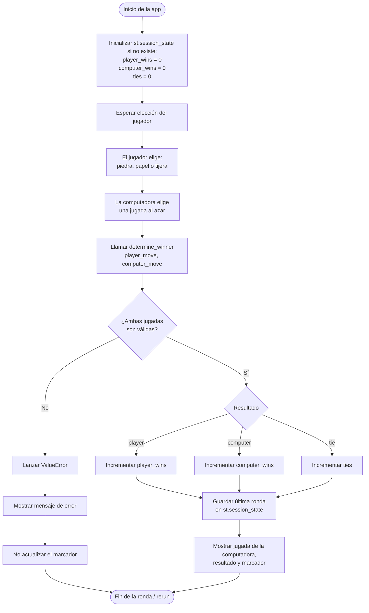

# Diagrama de flujo

```mermaid
flowchart TD
    A([Inicio de la app]) --> B[Inicializar st.session_state si no existe:<br/>player_wins = 0<br/>computer_wins = 0<br/>ties = 0]
    B --> C[Esperar elección del jugador]
    C --> D[El jugador elige:<br/>piedra, papel o tijera]
    D --> E[La computadora elige<br/>una jugada al azar]
    E --> F[Llamar determine_winner<br/>player_move, computer_move]
    F --> G{¿Ambas jugadas<br/>son válidas?}
    G -- No --> H[Lanzar ValueError]
    H --> I[Mostrar mensaje de error]
    I --> J[No actualizar el marcador]
    J --> K([Fin de la ronda / rerun])
    G -- Sí --> L{Resultado}
    L -- player --> M[Incrementar player_wins]
    L -- computer --> N[Incrementar computer_wins]
    L -- tie --> O[Incrementar ties]
    M --> P[Guardar última ronda<br/>en st.session_state]
    N --> P
    O --> P
    P --> Q[Mostrar jugada de la computadora,<br/>resultado y marcador]
    Q --> K
```
